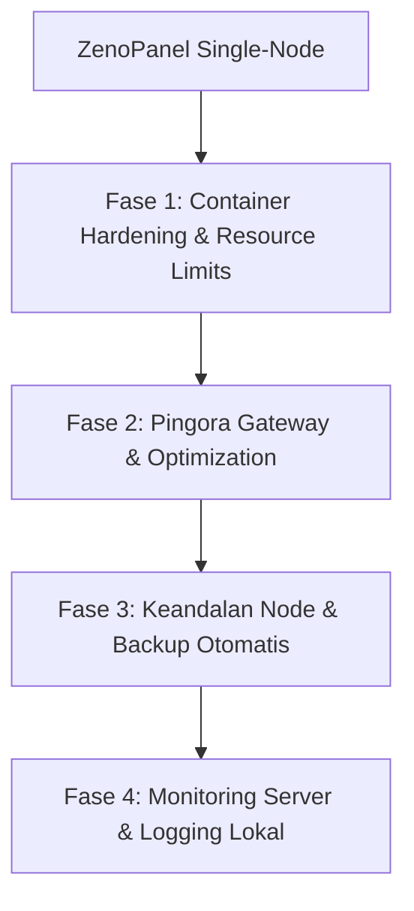

# Roadmap: ZenoPanel Platform Hosting (Single-VPS Production Grade)

Dokumen ini memuat rencana jangka panjang untuk memposisikan **ZenoPanel** sebagai platform hosting tunggal (*Single-VPS*) yang handal, aman, dan efisien untuk menjalankan aplikasi ERP mandiri (*standalone*) beserta database-nya di dalam satu server fisik/virtual.

---

## Peta Jalan (Roadmap) Single-VPS Hosting

### Fase 1: Container Hardening & Resource Limits (SELESAI)
Isolasi ketat kontainer untuk menjamin keandalan transaksi ERP dan mencegah kontainer aplikasi mengganggu kontainer database pada server VPS yang sama.
*   **Penyetelan Resource Dinamis via UI & CLI**: Mendukung limit memori, CPU, dan pengaturan prioritas `oom_score_adj`.
*   **Sandboxing**: Dukungan Read-Only root filesystem dengan otomatisasi mount `tmpfs` untuk folder temporary (`/tmp` dan `/run`).

---

### Fase 2: Optimalisasi Pingora Gateway & Jaringan (SELESAI)
Mengoptimalkan proxy layer Pingora (Rust) untuk meniadakan bottleneck jaringan dan menyederhanakan keamanan enkripsi.
*   **Upstream Connection Pooling (Keep-Alive)**: Mengaktifkan reuse socket TCP ke kontainer aplikasi guna memotong latensi handshake.
*   **Dynamic Timeouts (WebSockets/SSE)**: Penyetelan timeout panjang secara dinamis (1 jam) untuk WebSockets/SSE real-time, dan timeout ketat (15 detik) untuk HTTP biasa.
*   **Dynamic CORS Header Injection**: Injeksi header CORS otomatis berbasis `Origin` request client untuk memudahkan komunikasi API lintas domain antar tenant.
*   **TLS/SSL Hardening**: Penguncian cipher suite rustls ke standar modern (hanya TLS 1.2 & TLS 1.3) guna menjamin kelolosan audit keamanan IT.

---

### Fase 3: Keandalan Node & Backup Otomatis (Langkah Berikutnya)
Menyediakan mekanisme perlindungan data dan pemulihan cepat untuk mengantisipasi kegagalan server pada VPS tunggal.

*   **Pencadangan Otomatis Terjadwal (Auto-Backup & Disaster Recovery)**:
    *   Fitur terjadwal untuk mengompresi volume kontainer (data unggahan ERP) dan melakukan *dump* database, lalu mengunggah hasilnya ke penyimpanan eksternal aman (seperti S3-compatible Object Storage atau server cadangan via SFTP) setiap malam.
*   **Penyetelan Swap & Cgroups Memory Limits**:
    *   Konfigurasi cgroups yang ketat pada kontainer database (misal PostgreSQL) untuk mengamankan minimal sisa RAM server agar kernel host tidak membunuh proses database secara tiba-tiba saat aplikasi web memakan banyak memori.
*   **Local Auto-Healing & Health Check Monitor**:
    *   Daemon ZenoPanel secara berkala mengecek kesehatan kontainer secara lokal. Jika kontainer ERP gantung (misal mengembalikan status HTTP 5xx) atau mati, daemon akan me-restart kontainer tersebut secara otomatis.

---

### Fase 4: Monitoring Server & Logging Lokal
Menyediakan visibilitas performa infrastruktur server tunggal agar sysadmin dapat memantau kesehatan server secara proaktif.

*   **Visualisasi Metrik Resource Lokal**:
    *   Dashboard grafik di UI ZenoPanel untuk memantau penggunaan CPU, RAM, Disk, dan Swap dari server host serta masing-masing kontainer yang aktif.
*   **Rotasi & Analisis Log Lokal**:
    *   Rotasi otomatis untuk file access log Pingora, WAF logs, dan log kontainer untuk mencegah disk VPS penuh secara tiba-tiba.
