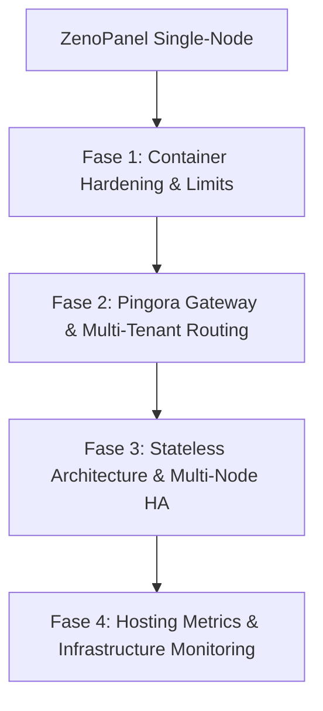

# Roadmap: ZenoPanel Platform Hosting (Enterprise & ERP Grade)

Dokumen ini memuat rencana jangka panjang untuk memposisikan **ZenoPanel** sebagai platform/control panel hosting yang tangguh, aman, dan siap untuk menjalankan aplikasi enterprise seperti **ERP (Enterprise Resource Planning)** yang berdiri sendiri (*standalone*) dalam model deployment *stateless* dan *high-concurrency*.

---

## Peta Jalan (Roadmap) Hosting Platform

### Fase 1: Container Hardening & Resource Limits (SELESAI)
Isolasi ketat kontainer untuk menjamin keandalan pemrosesan transaksi ERP yang intensif dan mencegah satu kontainer mengganggu kontainer lainnya.
*   **Penyetelan Resource Dinamis via UI & CLI**: Mendukung limit memori, CPU, dan pengaturan prioritas `oom_score_adj`.
*   **Sandboxing**: Dukungan Read-Only root filesystem dengan otomatisasi mount `tmpfs` untuk folder temporary (`/tmp` dan `/run`).

---

### Fase 2: Optimalisasi Pingora Gateway & Jaringan (SELESAI)
Mengoptimalkan proxy layer Pingora (Rust) untuk meniadakan bottleneck jaringan dan mendukung deployment multi-tenant/multi-cabang.
*   **Upstream Connection Pooling (Keep-Alive)**: Mengaktifkan reuse socket TCP ke kontainer aplikasi guna memotong latensi handshake.
*   **Dynamic Timeouts (WebSockets/SSE)**: Penyetelan timeout panjang secara dinamis (1 jam) untuk WebSockets/SSE real-time, dan timeout ketat (15 detik) untuk HTTP biasa.
*   **Dynamic CORS Header Injection**: Injeksi header CORS otomatis berbasis `Origin` request client untuk memudahkan komunikasi API lintas domain antar tenant.
*   **TLS/SSL Hardening**: Penguncian cipher suite rustls ke standar modern (hanya TLS 1.2 & TLS 1.3) guna menjamin kelolosan audit keamanan IT.

---

### Fase 3: Arsitektur Stateless & Multi-Node HA (Langkah Berikutnya)
Menyediakan fitur di panel untuk mendukung deployment ERP stateless yang terdistribusi agar terhindar dari *Single Point of Failure*.

*   **Integrasi Volume Shared Storage (Penyimpanan Bersama)**:
    *   Sediakan opsi volume khusus di UI/CLI untuk melakukan bind mount direktori penyimpanan terdistribusi (seperti NFS, GlusterFS, atau folder FUSE S3-compatible yang ter-mount di host) ke direktori upload media ERP.
*   **Health Check Endpoint untuk External Load Balancer (SELESAI)**:
    *   Endpoint `/health` asinkron pada gateway Pingora untuk mendeteksi status keaktifan node ZenoPanel.
*   **Panduan Pemisahan Layer Stateful (Database Terkluster)**:
    *   Panduan deployment kontainer ERP stateless yang terhubung secara eksternal ke managed database terkluster (seperti AWS RDS / PostgreSQL Cluster).
*   **ZenoPanel Cluster Sync (Rencana Depan)**:
    *   Mekanisme sinkronisasi otomatis konfigurasi aturan proxy dan berkas deployment kontainer ke beberapa node ZenoPanel yang terdaftar dalam satu cluster.

---

### Fase 4: Infrastruktur Monitoring & Hosting Logs
Menyediakan visibilitas performa infrastruktur server hosting untuk mendeteksi anomali sebelum memengaruhi aplikasi ERP tenant.

*   **Log Akses & WAF Terpusat**:
    *   Salurkan log deteksi serangan SQL Injection/XSS dari WAF ZenoPanel ke platform eksternal (Loki/Elasticsearch) agar sysadmin hosting dapat menganalisis ancaman.
*   **Prometheus Metrics Endpoint**:
    *   Menyediakan metrik utilisasi CPU/RAM per kontainer ERP, throughput request per detik di Pingora, serta latency response API untuk dipantau secara real-time melalui Grafana Dashboard.
