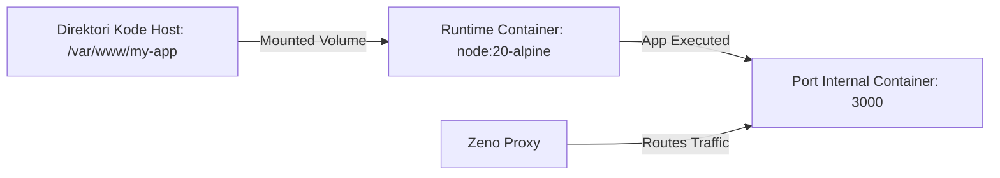

# Rencana Implementasi: Zeno Container (Docker Engine)

Dokumen ini menjelaskan rencana rancangan dan langkah-langkah implementasi untuk fitur **Zeno Container** menggunakan integrasi langsung dengan **Docker Engine** melalui Unix Domain Socket.

---

## 1. Arsitektur Integrasi

ZenoPanel akan bertindak sebagai klien orkestrasi yang berkomunikasi langsung dengan Docker daemon lokal di host server.

```mermaid
graph TD
    UI[ZenoPanel UI] -->|AJAX/Fetch| Axum[Axum Backend /api/containers]
    Axum -->|bollard Crate / Unix Socket| DockerSock[/var/run/docker.sock]
    DockerSock -->|Docker API| DockerDaemon[Docker Daemon]
    DockerDaemon -->|Spawns / Manages| Container[App Containers]
    Proxy[Zeno Proxy] -->|Forward Request| Container
```

### Komponen Utama:
1. **Unix Socket Connection**: Menggunakan crate `bollard` (klien Docker Rust yang asinkron dan lengkap) untuk berinteraksi dengan `/var/run/docker.sock`.
2. **Backend Engine (`src/containerman.rs`)**:
   - Modul khusus Rust untuk enkapsulasi panggilan Docker API (Pull, Create, Start, Stop, Delete, Logs).
3. **Dynamic Proxy Mapping**:
   - Reverse proxy ZenoPanel dapat secara otomatis mendeteksi port dinamis container untuk meneruskan request (reverse proxying) berdasarkan domain atau prefix path.

---

## 2. Rencana API Endpoints (Axum Backend)

Seluruh endpoint keamanan dilindungi oleh role gating (khusus role `admin` dan `editor`):

- **`GET /api/containers`**
  Mengembalikan daftar semua container di server beserta status (running, stopped), port mapping, dan penggunaan resource (CPU/RAM).
- **`POST /api/containers/create`**
  Membuat container baru. Menerima payload:
  ```json
  {
    "image": "nginx:alpine",
    "name": "my-web-app",
    "ports": ["8080:80"],
    "env": ["DATABASE_URL=postgres://..."],
    "volumes": ["/var/www:/usr/share/nginx/html"]
  }
  ```
- **`POST /api/containers/:id/start`**
  Menjalankan container yang mati.
- **`POST /api/containers/:id/stop`**
  Menghentikan container dengan graceful shutdown.
- **`POST /api/containers/:id/restart`**
  Melakukan restart container.
- **`DELETE /api/containers/:id`**
  Menghapus container dari sistem.
- **`GET /api/containers/:id/logs`**
  Streaming log stdout & stderr real-time menggunakan Server-Sent Events (SSE).

---

## 3. Rencana UI (Zeno Blade Template)

Membuat tampilan manajemen container yang premium dan interaktif pada file `views/partials/tab_containers.blade.zl`:

1. **Dashboard Overview**:
   - Total container aktif / non-aktif.
   - Grafik penggunaan resource container global.
2. **Container List Table**:
   - Menampilkan Nama, Image, Status, Ports, Uptime.
   - Tombol Aksi Dropdown: Start, Stop, Restart, Logs, dan Delete.
3. **Form Deploy Container**:
   - Input Image Name (mendukung auto-pull dari Docker Hub jika belum ada secara lokal).
   - Pengaturan Port Mapping (Host Port ke Container Port).
   - Pengaturan Environment Variables (Dynamic key-value inputs).
   - Pengaturan Volume Mounts (Host Path ke Container Path).

---

## 4. Langkah-Langkah Implementasi

### Langkah 1: Persiapan Dependensi
Tambahkan pustaka `bollard` ke dalam berkas `Cargo.toml`:
```toml
bollard = "0.15"
```

### Langkah 2: Buat Modul `src/containerman.rs`
Buat struktur `ContainerManager` untuk menangani inisialisasi koneksi socket dan fungsi-fungsi wrapper Docker API.

### Langkah 3: Integrasikan ke `src/main.rs` dan `zsrc/routes`
- Daftarkan slot ZenoLang baru untuk manajemen container jika diperlukan, atau buat Axum Router handler langsung di `src/main.rs`.
- Tambahkan pengecekan kepemilikan file `/var/run/docker.sock` saat aplikasi startup.

### Langkah 4: Desain UI & Sidebar
- Tambahkan item menu "Containers" di `views/partials/sidebar.blade.zl`.
- Buat file view `views/partials/tab_containers.blade.zl`.
- Sertakan view baru tersebut ke dalam viewport utama di `views/zenopanel.blade.zl`.

### Langkah 5: Hubungkan JavaScript (`public/js/containers.js`)
- Buat file JS baru untuk menangani pengambilan data kontainer berkala (polling), submission form deploy, pemanggilan tombol aksi, dan inisialisasi streaming log.
- Daftarkan tab `containers` di `navigation.js` dan update class body gating di `app.js`.

### Langkah 6: Pengujian & Observabilitas
- Uji integrasi deploy kontainer populer (seperti `nginx` atau `redis`).
- Pastikan logs dan resource stats ter-update secara akurat di UI.

---

## 5. Rencana Pasca-Docker: Runtime & Multi-Language Hosting (PaaS Engine)

Setelah fitur Zeno Container stabil, ZenoPanel akan menyediakan fungsionalitas **Language Runtime Manager** untuk mendeploy aplikasi web dengan berbagai bahasa pemrograman secara instan tanpa menulis Dockerfile manual.

### Konsep Kerja Runtime
ZenoPanel akan menyediakan template runtime pra-konfigurasi berbasis Docker image resmi. Saat pengguna mengunggah kode aplikasi, ZenoPanel akan me-mount direktori kode tersebut ke dalam container runtime yang sesuai.



### Opsi Runtime yang Direncanakan:
1. **Node.js Runtime**
   - **Base Image**: `node:<version>-alpine` (versi didukung: `18`, `20`, `22`).
   - **Perilaku**: Otomatis mendeteksi `package.json`, menjalankan `npm install` saat pembuatan wadah, dan mengeksekusi `npm start` atau file entrypoint (misal `index.js`).
2. **Python Runtime**
   - **Base Image**: `python:<version>-alpine` (versi didukung: `3.9`, `3.10`, `3.11`, `3.12`).
   - **Perilaku**: Otomatis mendeteksi `requirements.txt`, membuat virtual environment atau menginstal dependensi via `pip install`, dan menjalankan python framework (Flask/FastAPI/Django) menggunakan command entrypoint (misal `uvicorn main:app --host 0.0.0.0 --port 8000`).
3. **PHP-FPM Runtime**
   - **Base Image**: `php:<version>-fpm-alpine` (versi didukung: `8.0`, `8.1`, `8.2`, `8.3`).
   - **Perilaku**: Melayani file statis PHP secara langsung dengan mengintegrasikan server web internal atau menyambungkan soket PHP-FPM ke konfigurasi Nginx/Zeno proxy internal.
4. **Go Runtime (Build-and-Run)**
   - **Base Image**: `golang:<version>-alpine` (versi didukung: `1.20`, `1.21`, `1.22`).
   - **Perilaku**: Melakukan kompilasi source code (`go build`) langsung di dalam container, kemudian menjalankan binary hasilnya di runtime container minimal (`alpine` / `scratch`).
5. **.NET (C#) Runtime (Build-and-Run)**
   - **Base Image**: `mcr.microsoft.com/dotnet/sdk:<version>-alpine` (build) & `mcr.microsoft.com/dotnet/aspnet:<version>-alpine` (runtime) (versi didukung: `6.0`, `7.0`, `8.0`).
   - **Perilaku**: Mendeteksi file `.csproj` atau `.sln`, menjalankan perintah `dotnet publish` untuk menghasilkan *compiled binary* / DLL, dan mengeksekusi aplikasi web ASP.NET Core menggunakan base image runtime yang hemat resource.

### Alur UI untuk Pengguna (PaaS Experience)
1. **Pilih Sumber Kode**: Pengguna memilih direktori root proyeknya via dropdown/File Manager.
2. **Pilih Language Runtime**: Dropdown pemilihan bahasa (Node.js, Python, PHP, dll) beserta versinya.
3. **Set Port & Env**: Menentukan port tempat aplikasi mendengarkan koneksi (misal 3000) dan variabel lingkungan pendukung.
4. **Deploy**: ZenoPanel secara cerdas membuat container runtime khusus, memasang volume kode, menginstal dependensi, mengeksekusi startup script, dan langsung menyambungkannya ke sistem reverse proxy ZenoPanel untuk domain target.
