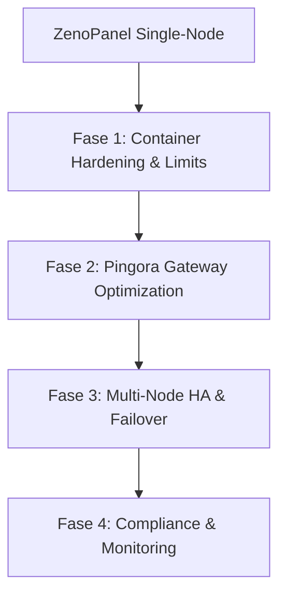

# Roadmap: Next-Level ZenoPanel (Enterprise & Healthcare Grade)

Dokumen ini memuat rencana jangka panjang untuk meningkatkan ZenoPanel dan `zeno-container` dari solusi manajemen kontainer single-node menjadi platform hosting aplikasi *mission-critical* berkeandalan tinggi (High Availability) yang aman dan siap untuk industri medis (healthcare).

---

## Peta Jalan (Roadmap) Naik Kelas

### Fase 1: Container Hardening & Resource Isolation
Fokus pada penguatan isolasi kontainer di server host demi ketahanan terhadap beban tinggi dan serangan.

*   **Penyetelan Resource Dinamis via UI**:
    *   Integrasikan input batas CPU dan memori langsung ke modal pembuatan kontainer di ZenoPanel UI.
    *   Terapkan parameter `oom_score_adj` untuk memastikan jika server kehabisan RAM, proses sistem kritis (seperti ZenoPanel & Pingora) memiliki prioritas tertinggi dan tidak dihentikan oleh kernel, melainkan kontainer backend yang tidak stabil yang dikorbankan.
*   **Sandboxing Tambahan**:
    *   Sediakan opsi **Read-Only Root Filesystem** pada pembuatan kontainer untuk memastikan file aplikasi utama tidak dapat dimodifikasi oleh peretas.
    *   Gunakan volume `tmpfs` memori internal secara otomatis untuk folder temporary seperti `/tmp` dan `/run`.
    *   Sempurnakan mode **Rootless Container** secara default agar kontainer tidak memiliki akses root fisik ke kernel host.

---

### Fase 2: Optimalisasi Pingora Gateway & Jaringan
Mengoptimalkan proxy layer Pingora (Rust) untuk meniadakan bottleneck jaringan dan menyederhanakan keamanan enkripsi.

*   **Upstream Connection Pooling (Keep-Alive)**:
    *   Konfigurasikan reuse socket TCP pada Pingora ke kontainer upstream. Ini sangat mengurangi waktu jabat tangan (*handshake*) TCP dan memangkas penggunaan CPU host hingga 30% pada beban tinggi.
*   **Dukungan Protokol Real-Time**:
    *   Pastikan konfigurasi Pingora mendukung transfer data berkelanjutan untuk **WebSockets** dan **Server-Sent Events (SSE)** dengan melonggarkan batas timeout baca/tulis khusus untuk rute realtime tanpa memutuskan koneksi secara sepihak.
*   **Manajemen SSL/TLS Kelas Industri**:
    *   Otomatisasi perpanjangan Let's Encrypt dengan enkripsi kuat (TLS 1.2 dan TLS 1.3 saja).
    *   Nonaktifkan sandi (*cipher*) lemah untuk memenuhi syarat audit keamanan data medis/keuangan.

---

### Fase 3: Multi-Node & High Availability (HA)
Menghilangkan ketergantungan pada server tunggal (*Single Point of Failure*) agar sistem tetap menyala 24/7 meskipun salah satu VPS mati.

*   **ZenoPanel Cluster Sync**:
    *   Mekanisme sinkronisasi konfigurasi kontainer, berkas compose, dan aturan proxy (*proxy rules*) ke beberapa server ZenoPanel yang terdaftar dalam satu kluster.
*   **Health Check Endpoint untuk Load Balancer**:
    *   Pingora menyediakan rute `/health` yang mendeteksi status keaktifan server.
    *   Gunakan Load Balancer pihak ketiga (seperti Cloudflare Load Balancer, AWS ALB, atau F5) untuk mendeteksi kegagalan server ZenoPanel dan mengalihkan traffic secara instan ke server cadangan.
*   **Pemisahan Layer Stateful & Stateless**:
    *   Panduan integrasi database eksternal terkluster (seperti managed PostgreSQL/MySQL dengan replikasi *hot standby*) sehingga data rumah sakit selalu aman dan tersinkronisasi di luar server aplikasi.

---

### Fase 4: Kepatuhan Regulasi & Pemantauan
Memenuhi regulasi perlindungan data medis (seperti HIPAA di AS atau regulasi data kesehatan lokal) serta visibilitas metrik server secara real-time.

*   **Log Audit Keamanan (Audit Trails)**:
    *   Catat secara detail setiap tindakan administratif di ZenoPanel (siapa yang membuat kontainer, mengubah proxy, menonaktifkan WAF, dll.) untuk keperluan forensik keamanan.
*   **Streaming Log WAF Terpusat**:
    *   Salurkan log deteksi serangan SQL Injection/XSS dari [waf.rs](file:///home/max/Documents/PROJ/github/zenopanel/src/waf.rs) ke sistem log terpusat (seperti Loki, Elasticsearch, atau Syslog server) agar tim IT rumah sakit dapat memantau ancaman secara real-time.
*   **Prometheus Metrics Endpoint**:
    *   Ekspos metrik performa server (penggunaan CPU/RAM per kontainer, jumlah request per detik di Pingora, persentase error 5xx) agar bisa dipantau secara visual menggunakan Grafana Dashboard.
