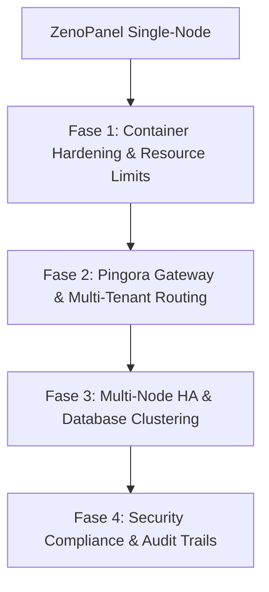

# Roadmap: Next-Level ZenoPanel (Enterprise & ERP Grade)

Dokumen ini memuat rencana jangka panjang untuk meningkatkan ZenoPanel dan `zeno-container` dari solusi manajemen kontainer single-node menjadi platform hosting aplikasi *mission-critical* berkeandalan tinggi (High Availability) yang aman, scalable, dan siap untuk sistem **ERP (Enterprise Resource Planning)** skala menengah hingga besar.

---

## Peta Jalan (Roadmap) Naik Kelas

### Fase 1: Container Hardening & Resource Limits
Fokus pada penguatan isolasi kontainer untuk menjamin keandalan pemrosesan transaksi ERP yang intensif dan mencegah *resource monopoly*.

*   **Penyetelan Resource Dinamis via UI**:
    *   Integrasikan input batas CPU dan memori langsung ke modal pembuatan kontainer di ZenoPanel UI.
    *   Terapkan parameter `oom_score_adj` untuk memastikan jika server kehabisan RAM akibat pemrosesan laporan keuangan besar, proses sistem kritis (seperti ZenoPanel & Pingora) memiliki prioritas tertinggi dan tidak dihentikan oleh kernel, melainkan kontainer worker backend yang tidak stabil yang dikorbankan.
*   **Sandboxing Tambahan**:
    *   Sediakan opsi **Read-Only Root Filesystem** pada pembuatan kontainer untuk memastikan file aplikasi utama tidak dapat dimodifikasi oleh peretas.
    *   Gunakan volume `tmpfs` memori internal secara otomatis untuk folder temporary seperti `/tmp` dan `/run`.
    *   Sempurnakan mode **Rootless Container** secara default agar kontainer tidak memiliki akses root fisik ke kernel host.

---

### Fase 2: Optimalisasi Pingora Gateway & Multi-Tenant Routing
Mengoptimalkan proxy layer Pingora (Rust) untuk meniadakan bottleneck jaringan pada ribuan koneksi konkuren dan mendukung sistem ERP multi-cabang/multi-tenant.

*   **Upstream Connection Pooling (Keep-Alive)**:
    *   Konfigurasikan reuse socket TCP pada Pingora ke kontainer upstream. Ini sangat mengurangi waktu jabat tangan (*handshake*) TCP dan memangkas penggunaan CPU host hingga 30% pada beban tinggi.
*   **Dukungan Protokol Real-Time**:
    *   Pastikan konfigurasi Pingora mendukung transfer data berkelanjutan untuk **WebSockets** (sangat krusial untuk dashboard monitoring stock real-time) dan **Server-Sent Events (SSE)**.
*   **Manajemen SSL/TLS & CORS Dinamis**:
    *   Otomatisasi perpanjangan Let's Encrypt untuk puluhan domain/subdomain tenant ERP.
    *   Dukungan konfigurasi CORS dinamis untuk multi-domain tenant agar integrasi API eksternal (seperti payment gateway, logistik, perpajakan) tetap aman dan lancar.
    *   Nonaktifkan sandi (*cipher*) lemah untuk memenuhi syarat audit keamanan data keuangan perusahaan.

---

### Fase 3: Multi-Node HA & Database Clustering
Menghilangkan ketergantungan pada server tunggal (*Single Point of Failure*) agar operasional bisnis ERP (penjualan, gudang, HR) tetap berjalan 24/7 meskipun salah satu VPS mati.

*   **ZenoPanel Cluster Sync**:
    *   Mekanisme sinkronisasi konfigurasi kontainer, berkas compose, dan aturan proxy (*proxy rules*) ke beberapa server ZenoPanel yang terdaftar dalam satu kluster.
*   **Shared Storage Integration**:
    *   Dukungan integrasi volume penyimpanan terdistribusi (seperti NFS, GlusterFS, atau S3-compatible object storage) untuk menampung file lampiran ERP (invoices, PDF PO, foto produk) secara terpusat dan aman.
*   **Health Check Endpoint untuk Load Balancer**:
    *   Pingora menyediakan rute `/health` yang mendeteksi status keaktifan server.
    *   Gunakan Load Balancer pihak ketiga (seperti Cloudflare Load Balancer, AWS ALB, atau HAProxy) untuk mengalihkan traffic secara instan ke server cadangan jika terjadi kegagalan node.
*   **Pemisahan Layer Stateful & Stateless**:
    *   Panduan integrasi database eksternal terkluster (seperti managed PostgreSQL/MySQL dengan replikasi *Master-Slave / Write-Read Split*) sehingga database ERP tidak terbebani oleh beban pembacaan laporan (reporting) yang berat.

---

### Fase 4: Security Compliance & Audit Trails
Memenuhi regulasi perlindungan data komersial perusahaan, kepatuhan audit sistem informasi keuangan, serta visibilitas metrik server secara real-time.

*   **Log Audit Keamanan (Audit Trails) ERP**:
    *   Catat secara detail setiap tindakan administratif di ZenoPanel (siapa yang membuat kontainer, mengubah routing tenant, menonaktifkan WAF, mengubah alokasi RAM database, dll.) untuk keperluan forensik dan audit internal kepatuhan IT.
*   **Streaming Log WAF Terpusat**:
    *   Salurkan log deteksi serangan SQL Injection/XSS dari [waf.rs](file:///home/max/Documents/PROJ/github/zenopanel/src/waf.rs) ke sistem log terpusat (seperti Loki, Elasticsearch, atau Syslog server) agar tim IT perusahaan dapat memantau ancaman secara real-time.
*   **Prometheus Metrics Endpoint**:
    *   Ekspos metrik performa server (penggunaan CPU/RAM per kontainer database, jumlah request per detik di Pingora, persentase error 5xx, antrean background worker ERP) agar bisa dipantau secara visual menggunakan Grafana Dashboard.
