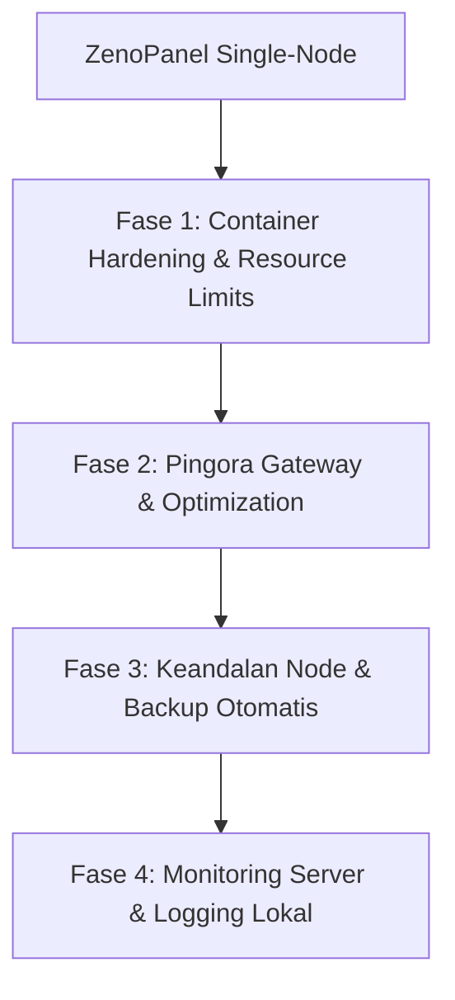

# Roadmap: ZenoPanel Platform Hosting (Single-VPS Production Grade)

Dokumen ini memuat rencana jangka panjang untuk memposisikan **ZenoPanel** sebagai platform hosting tunggal (*Single-VPS*) yang handal, aman, dan efisien untuk menjalankan aplikasi ERP mandiri (*standalone*) beserta database-nya di dalam satu server fisik/virtual.

---

## Peta Jalan (Roadmap) Single-VPS Hosting

### Fase 1: Container Hardening & Resource Limits (SELESAI)
Isolasi ketat kontainer untuk menjamin keandalan transaksi ERP dan mencegah kontainer aplikasi mengganggu kontainer database pada server VPS yang sama.
*   **Penyetelan Resource Dinamis via UI & CLI**: Mendukung limit memori, CPU, dan pengaturan prioritas `oom_score_adj`.
*   **Sandboxing**: Dukungan Read-Only root filesystem dengan otomatisasi mount `tmpfs` untuk folder temporary (`/tmp` dan `/run`).

---

### Fase 2: Optimalisasi Pingora Gateway & Jaringan (SELESAI)
Mengoptimalkan proxy layer Pingora (Rust) untuk meniadakan bottleneck jaringan dan menyederhanakan keamanan enkripsi.
*   **Upstream Connection Pooling (Keep-Alive)**: Mengaktifkan reuse socket TCP ke kontainer aplikasi guna memotong latensi handshake.
*   **Dynamic Timeouts (WebSockets/SSE)**: Penyetelan timeout panjang secara dinamis (1 jam) untuk WebSockets/SSE real-time, dan timeout ketat (15 detik) untuk HTTP biasa.
*   **Dynamic CORS Header Injection**: Injeksi header CORS otomatis berbasis `Origin` request client untuk memudahkan komunikasi API lintas domain antar tenant.
*   **TLS/SSL Hardening**: Penguncian cipher suite rustls ke standar modern (hanya TLS 1.2 & TLS 1.3) guna menjamin kelolosan audit keamanan IT.

---

### Fase 3: Keandalan Node & Backup Otomatis (SELESAI)
Menyediakan mekanisme perlindungan data dan pemulihan cepat untuk mengantisipasi kegagalan server pada VPS tunggal.

*   **Pencadangan Otomatis Terjadwal (Auto-Backup & Disaster Recovery)**:
    *   Fitur terjadwal untuk mengompresi volume kontainer (data unggahan ERP) dan melakukan *dump* database, lalu mengunggah hasilnya ke penyimpanan eksternal aman (seperti S3-compatible Object Storage atau server cadangan via SFTP) setiap malam.
*   **Penyetelan Swap & Cgroups Memory Limits**:
    *   Konfigurasi cgroups yang ketat pada kontainer database (misal PostgreSQL) untuk mengamankan minimal sisa RAM server agar kernel host tidak membunuh proses database secara tiba-tiba saat aplikasi web memakan banyak memori.
*   **Local Auto-Healing & Health Check Monitor**:
    *   Daemon ZenoPanel secara berkala mengecek kesehatan kontainer secara lokal. Jika kontainer ERP gantung (misal mengembalikan status HTTP 5xx) atau mati, daemon akan me-restart kontainer tersebut secara otomatis.

---

### Fase 4: Monitoring Server & Logging Lokal (SELESAI)
Menyediakan visibilitas performa infrastruktur server tunggal agar sysadmin dapat memantau kesehatan server secara proaktif.

*   **Visualisasi Metrik Resource Lokal**:
    *   Dashboard grafik di UI ZenoPanel untuk memantau penggunaan CPU, RAM, Disk, dan Swap dari server host serta masing-masing kontainer yang aktif.
*   **Rotasi & Analisis Log Lokal**:
    *   Rotasi otomatis untuk file access log Pingora, WAF logs, dan log kontainer untuk mencegah disk VPS penuh secara tiba-tiba.

---

### Fase 5: Manajemen Database Terintegrasi (SELESAI)
Menghadirkan fitur manajemen database setara aaPanel / 1Panel — langsung dari UI ZenoPanel, tanpa perlu tools eksternal seperti phpMyAdmin.

*   **Multi-Driver Connection Pool (Rust/SQLx)**:
    *   `DBManager` (Arc + RwLock) mendukung tiga jenis pool sekaligus: **SQLite** (panel internal), **MySQL/MariaDB**, dan **PostgreSQL**.
    *   Koneksi dimuat otomatis saat startup dari tabel `db_servers` di database panel.
    *   Slot ZenoCore baru: `db.connect` dan `db.disconnect` untuk mengelola pool secara dinamis dari ZenoLang route.

*   **Dashboard Database Servers**:
    *   Registrasi server database eksternal (MySQL/MariaDB/PostgreSQL) via UI dengan **uji koneksi otomatis** sebelum menyimpan.
    *   Tabel daftar server terdaftar beserta engine, host:port, dan akun admin.
    *   Hapus registrasi server (pool dilepas otomatis).

*   **Lifecycle Database & User Management**:
    *   Buat database baru beserta user eksklusifnya di server target (MySQL `CREATE DATABASE` + `CREATE USER` + `GRANT`, atau PostgreSQL equivalent) — satu klik dari UI.
    *   Pilih akses: `localhost` atau `remote (%)`.
    *   Ganti password user database langsung dari panel (`ALTER USER`).
    *   Drop database dan hapus user secara bersamaan (`DROP DATABASE` + `DROP USER`).
    *   Generator password acak 16 karakter (special chars included).
    *   Tampilkan/sembunyikan password tersimpan di tabel (toggle eye icon).

*   **SQL Query Console**:
    *   Multi-connection console: pilih koneksi (panel SQLite, server admin, atau user database tertentu) dari dropdown.
    *   Sidebar daftar tabel otomatis (klik tabel → auto-isi `SELECT * FROM table LIMIT 10`).
    *   Badge driver aktif (SQLITE / MYSQL / POSTGRES).
    *   Mode SELECT vs. Execute command (checkbox toggle).
    *   Hasil query ditampilkan sebagai tabel dinamis; perintah non-SELECT menampilkan `rows_affected` dan `last_insert_id`.
    *   Tombol shortcut "Buka Console" dari baris tabel databases langsung membuka console dengan koneksi yang sesuai.

*   **API Routes (ZenoLang)**:
    *   `GET /api/database/servers` — list server terdaftar
    *   `POST /api/database/servers` — registrasi + uji koneksi
    *   `DELETE /api/database/servers` — hapus registrasi
    *   `GET /api/database/list` — list semua user database
    *   `POST /api/database/create` — buat database + user
    *   `POST /api/database/change-password` — ganti password user DB
    *   `POST /api/database/delete` — drop database + user
    *   `GET /api/database/tables` — list tabel dari koneksi aktif
    *   `POST /api/database/query` — eksekusi raw SQL (SELECT atau command)

---

### Fase 6: Manajemen Firewall Native (iptables-based) (TERENCANA)
Menghadirkan fitur keamanan jaringan terintegrasi menggunakan `iptables` bawaan Linux tanpa dependensi aplikasi pihak ketiga (seperti `ufw` atau `firewalld`), menjamin kompatibilitas penuh dengan Alpine Linux.

#### 🔑 Detail Teknis & Desain Keamanan:
- **Zero-Dependency**: Menggunakan perintah `iptables` tingkat rendah langsung dari backend Rust untuk mengelola tabel `FILTER` (rantai `INPUT`).
- **Safety comments**: Setiap aturan ditambahkan dengan komentar khusus `-m comment --comment "ZenoPanel: <Nama Aturan>"` agar panel hanya mendeteksi dan mengelola aturan buatannya sendiri secara aman tanpa merusak aturan sistem OS.
- **Lockout Protection**: Validasi otomatis untuk memblokir penutupan port SSH (`22`) dan port utama panel (`3000`/`8443`) secara tidak sengaja untuk mencegah pengguna terkunci dari luar.

#### 🛠️ Rincian Perubahan Kode:

##### 1. Backend Slots (`src/slots/system.rs`)
Dua slot baru akan didaftarkan ke ZenoEngine:
- `system.firewall_status`: Menjalankan perintah `iptables -S INPUT` (atau `iptables -L INPUT --line-numbers`) untuk melacak aturan aktif, lalu menyaring baris yang memiliki komentar `"ZenoPanel:"` untuk dikembalikan ke scope sebagai JSON list.
- `system.firewall_rule_add` / `system.firewall_rule_delete`:
  - Menambah aturan: `iptables -A INPUT -p <proto> --dport <port> -j <action> -m comment --comment "ZenoPanel: <name>"`
  - Menghapus aturan: `iptables -D INPUT -p <proto> --dport <port> -j <action> -m comment --comment "ZenoPanel: <name>"`

##### 2. ZenoLang Routing (`zsrc/routes/firewall.zl`)
Berkas rute baru untuk API endpoint:
- `GET /api/security/firewall` -> Mengembalikan daftar aturan aktif lewat pemanggilan slot `system.firewall_status`.
- `POST /api/security/firewall/add` -> Menerima parameter `{ name, port, protocol, action }` untuk mendaftarkan port.
- `POST /api/security/firewall/delete` -> Menerima parameter signature aturan yang akan dicocokkan dan dihapus dari kernel.

##### 3. Frontend UI (`views/partials/tab_security.blade.zl`)
- Menambahkan kartu antarmuka **Firewall Rules Manager** di bawah form pengaturan WAF.
- Tabel daftar aturan: Kolom **Rule Name**, **Port / Service**, **Protocol (TCP/UDP)**, **Action (ACCEPT/DROP)**, dan tombol **Delete Rule**.
- Modal popup untuk menambahkan aturan baru dengan formulir port, protokol, aksi, dan nama komentar.
- Script handler di `public/js/settings.js` untuk load, add, dan delete aturan secara asinkron (AJAX fetch).

---

#### 🧪 Rencana Verifikasi (Testing):
1. **Manual check**: Buka tab **Security**, pastikan tabel Firewall Rules Manager terload kosong (atau berisi aturan bawaan jika ada).
2. **Add Rule Test**: Tambahkan port MySQL `3316` TCP. Verifikasi di terminal host via `sudo iptables -S INPUT` apakah aturan `"ZenoPanel: MySQL External"` telah terdaftar.
3. **Connectivity Test**: Coba akses MySQL `3316` dari luar server. Pastikan terhubung saat status rule `ACCEPT`.
4. **Delete Rule Test**: Hapus rule dari UI, verifikasi aturan terhapus dari output `iptables` dan akses eksternal kembali diblokir.
